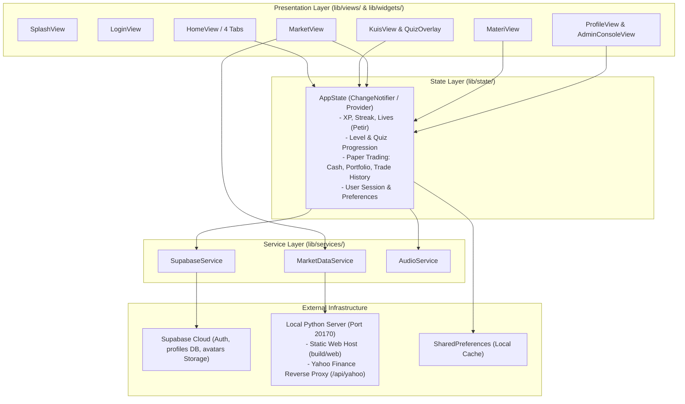

# Trade Heroes — Architecture & Data Flow Specification

## 1. System Overview
Trade Heroes (`kursus_saham`) is a gamified stock market education mobile & web app built with Flutter. It combines a Duolingo-style level roadmap for financial literacy with a realistic Indonesia Stock Exchange (BEI) paper trading simulator.

## 2. High-Level Architecture

## 3. Key Data & Execution Flows

### A. Authentication & Sync Flow
1. User logs in via `LoginView` using Email/Password, Google OAuth, or Guest Mode.
2. `SupabaseService` authenticates with Supabase Cloud.
3. On success, `AppState._applyProfileData()` loads remote user profile (`profiles` table).
4. Local offline cache is maintained in `SharedPreferences`. Background mutations sync back to Supabase.

### B. Gamified Quiz & Progression Flow
1. User selects a level from zigzag roadmap in `KuisView`.
2. `QuizOverlay` displays questions (multiple choice / essay) with instant feedback.
3. Wrong answers trigger shake animation, play error sound, and deduct 1 life (Petir).
4. Automatic life regen timer runs every 60 seconds (or refills via `AdOverlay` simulation).
5. Level completion awards XP, updates streaks, triggers chest unlocks, and unlocks badges.

### C. Live Market & Paper Trading Flow
1. `MarketView` queries `MarketDataService.fetchChart()` -> proxies through `server.py` (`/api/yahoo`) to get real OHLCV candlestick data for IDX tickers (BBCA, BBRI, TLKM, ASII, GOTO, etc.).
2. Order Book displays multi-level Bid/Offer queues; Running Trade simulates live transactions.
3. Paper Trading executes orders in `AppState.buyStock()` and `AppState.sellStock()`:
   - Initial cash: Rp 100,000,000.
   - Calculates 100 shares/lot and authentic BEI transaction fees (Buy: 0.15%, Sell: 0.25%).
   - Computes weighted average buy price and realized Profit & Loss (PnL).
   - Audio feedback played via `AudioService`.

## 4. Platform Adaptation & Web Frame
- Mobile: Renders native fullscreen.
- Web Desktop (>= 600px): `DeviceFrame` in `lib/main.dart` wraps the UI inside an iPhone 390x844 mockup with Dynamic Island and Home Indicator.
- Audio: Handled via Web JS interop (`window.playTradeSound`) and `audioplayers` package on mobile.
