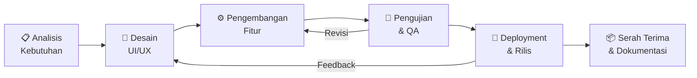

# BAB 1: PENDAHULUAN

---

## 1.1 Latar Belakang

Pertumbuhan jumlah investor ritel di pasar modal Indonesia dalam beberapa tahun terakhir menunjukkan tren yang sangat signifikan. Berdasarkan data Kustodian Sentral Efek Indonesia (KSEI), jumlah Single Investor Identification (SID) telah melampaui **13 juta akun** pada tahun 2024, meningkat lebih dari **400%** dibandingkan lima tahun sebelumnya. Mayoritas investor baru ini didominasi oleh generasi muda berusia 18–35 tahun yang tertarik berinvestasi saham melalui kemudahan aplikasi sekuritas digital di ponsel.

Namun, lonjakan kuantitas investor ini tidak selalu diikuti oleh peningkatan kualitas literasi keuangan yang memadai. Otoritas Jasa Keuangan (OJK) mencatat bahwa **indeks literasi keuangan masyarakat Indonesia baru mencapai 49,68%** pada Survei Nasional Literasi dan Inklusi Keuangan (SNLIK) tahun 2022. Artinya, masih terdapat lebih dari separuh masyarakat Indonesia yang belum memiliki pemahaman mendasar mengenai produk dan instrumen keuangan, termasuk saham.

Kondisi ini menimbulkan permasalahan nyata di lapangan: banyak investor pemula yang mengambil keputusan transaksi berdasarkan **rumor media sosial, ajakan komunitas tidak bertanggung jawab, atau sekadar mengikuti tren (FOMO — Fear of Missing Out)** tanpa dilandasi analisis fundamental maupun teknikal yang benar. Akibatnya, kerugian finansial yang dialami oleh trader pemula menjadi fenomena yang sangat umum dan berulang.

Di sisi lain, metode edukasi pasar modal konvensional — seperti seminar tatap muka, e-book statis, atau video YouTube berdurasi panjang — dinilai **kurang interaktif, membosankan, dan tidak memberikan umpan balik langsung** terhadap tingkat pemahaman peserta. Generasi muda saat ini membutuhkan pendekatan belajar yang lebih modern, personal, dan menyenangkan agar materi investasi saham dapat diserap secara efektif dan berkelanjutan.

Berdasarkan latar belakang di atas, dibutuhkan sebuah **platform edukasi saham berbasis aplikasi mobile native** yang menggabungkan kurikulum terstruktur dengan pendekatan **gamifikasi (belajar sambil bermain)**, sehingga proses belajar investasi saham menjadi pengalaman yang menyenangkan, terukur, dan mudah diakses kapan saja melalui perangkat ponsel pengguna.

---

## 1.2 Rumusan Masalah

Berdasarkan latar belakang yang telah diuraikan, berikut adalah rumusan permasalahan yang menjadi dasar pengembangan aplikasi ini:

1. **Rendahnya literasi keuangan dan pemahaman dasar pasar modal** di kalangan investor ritel pemula Indonesia, yang menyebabkan tingginya angka kerugian akibat keputusan investasi yang tidak rasional.

2. **Tidak tersedianya platform edukasi saham mobile yang interaktif dan terukur**, yang mampu memberikan umpan balik langsung terhadap tingkat pemahaman pengguna melalui mekanisme kuis, penilaian otomatis, dan pencatatan progres belajar.

3. **Rendahnya tingkat retensi dan konsistensi belajar** pada platform edukasi konvensional (buku, video, seminar), karena tidak adanya sistem motivasi dan penghargaan (reward) yang mendorong pengguna untuk terus belajar secara rutin.

4. **Kebutuhan akan model monetisasi yang berkelanjutan** bagi pemilik platform edukasi, agar aplikasi dapat terus dikembangkan dan diperbarui kontennya tanpa sepenuhnya bergantung pada biaya berlangganan pengguna.

---

## 1.3 Tujuan Proyek

### 1.3.1 Tujuan Umum
Membangun aplikasi mobile native lintas platform (Android & iOS) bernama **"Kursus Saham"** yang berfungsi sebagai platform edukasi pasar modal interaktif berbasis gamifikasi untuk meningkatkan literasi keuangan investor ritel pemula Indonesia.

### 1.3.2 Tujuan Khusus
1. Merancang dan mengimplementasikan **sistem kuis interaktif bertingkat** (10 level) yang mencakup materi pasar modal dari tingkat dasar hingga mahir, dengan tipe soal pilihan ganda dan isian esai.

2. Mengembangkan **mekanisme gamifikasi komprehensif** yang meliputi:
   - Sistem nyawa terbatas (Petir) dengan mekanisme pemulihan berbasis waktu.
   - Poin pengalaman (XP) dan target harian untuk mendorong konsistensi belajar.
   - Medali pencapaian (Badges) sebagai bentuk penghargaan atas pencapaian milestone tertentu.
   - Streak harian untuk memotivasi kebiasaan belajar berkesinambungan.

3. Menyediakan **perpustakaan materi edukasi terstruktur** yang terdiri dari modul bacaan, kumpulan tips trading praktis (dengan opsi unduh PDF), dan kamus istilah pasar modal interaktif dengan fitur pencarian instan.

4. Membangun **sistem profil pengguna personal** yang mencatat dan menampilkan statistik kemajuan belajar, koleksi medali, dan riwayat soal favorit secara transparan.

5. Mengimplementasikan **model monetisasi ganda** melalui iklan interstitial (non-intrusif) dan paket berlangganan Premium Plan yang memberikan akses tanpa batas dan bebas iklan.

---

## 1.4 Manfaat Proyek

### 1.4.1 Manfaat bagi Pengguna (End-User)
| No | Manfaat | Penjelasan |
|---|---|---|
| 1 | Belajar saham kapan saja dan di mana saja | Aplikasi mobile native dapat diakses secara offline setelah terinstal, tanpa memerlukan koneksi internet untuk mengerjakan kuis dan membaca materi. |
| 2 | Pemahaman terukur dan bertahap | Sistem level bertingkat memastikan pengguna mempelajari konsep secara berurutan, dari dasar menuju mahir, tanpa melewatkan fondasi penting. |
| 3 | Motivasi belajar yang berkelanjutan | Mekanisme XP, streak, dan medali menciptakan siklus motivasi positif yang mendorong pengguna untuk kembali belajar setiap hari. |
| 4 | Umpan balik instan | Setiap jawaban kuis langsung diperiksa dan disertai penjelasan edukatif, sehingga pengguna segera mengetahui letak kesalahannya. |
| 5 | Kamus referensi cepat | Kamus istilah pasar modal yang lengkap dan dapat dicari secara instan menjadi rujukan praktis saat pengguna menemukan istilah asing di platform trading mereka. |

### 1.4.2 Manfaat bagi Pemilik Aplikasi (Client / Stakeholder)
| No | Manfaat | Penjelasan |
|---|---|---|
| 1 | Pendapatan pasif dari iklan | Iklan interstitial dari broker sekuritas / platform investasi yang ditayangkan secara berkala menghasilkan pendapatan per-impresi (CPM) atau per-klik (CPC). |
| 2 | Pendapatan berlangganan (recurring revenue) | Paket Premium Plan menciptakan aliran pendapatan berulang bulanan/tahunan yang stabil dan dapat diprediksi. |
| 3 | Skalabilitas konten | Bank soal kuis dan modul materi dapat terus diperluas tanpa perlu merombak arsitektur aplikasi. |
| 4 | Jangkauan pasar luas | Dengan satu basis kode (Flutter), aplikasi langsung tersedia di dua ekosistem terbesar: Google Play Store (Android) dan Apple App Store (iOS). |
| 5 | Data insight pengguna | Statistik belajar pengguna dapat dianalisis untuk memahami topik mana yang paling sulit / paling diminati, sehingga konten edukasi dapat terus ditingkatkan kualitasnya. |

---

## 1.5 Ruang Lingkup Proyek (Scope of Work)

### 1.5.1 Ruang Lingkup yang Termasuk (In-Scope)
Berikut adalah cakupan pekerjaan yang akan dilaksanakan dalam proyek ini:

1. **Desain Antarmuka (UI/UX Design)**
   - Perancangan tampilan aplikasi dengan estetika Dark Theme premium.
   - Desain ikon navigasi, kartu modul, node peta level, dan elemen visual lainnya.
   - Perancangan alur pengguna (user flow) untuk seluruh fitur utama.

2. **Pengembangan Aplikasi (Development)**
   - Pembuatan aplikasi mobile native menggunakan framework Flutter (Dart).
   - Implementasi seluruh fitur fungsional: sistem kuis, materi, kamus, profil, petir, XP, medali, iklan, dan Premium Plan.
   - Penyimpanan data lokal terenkripsi di perangkat pengguna.

3. **Pengujian Aplikasi (Quality Assurance)**
   - Pengujian fungsional pada berbagai resolusi layar Android dan iOS.
   - Pengujian performa animasi dan transisi layar.
   - Verifikasi kode sumber melalui analisis statis (Flutter Analyze).

4. **Deployment & Distribusi**
   - Kompilasi file rilis Android (.apk / .aab) dan konfigurasi proyek iOS (Xcode).
   - Penyiapan aset untuk submission ke Google Play Store dan Apple App Store (ikon, screenshot, deskripsi).

5. **Serah Terima & Dokumentasi**
   - Penyerahan seluruh kode sumber (source code) dalam format repositori terstruktur.
   - Penyerahan dokumen panduan administrator untuk pengelolaan konten kuis dan materi.

### 1.5.2 Ruang Lingkup yang Tidak Termasuk (Out-of-Scope)
Berikut adalah item yang **tidak** termasuk dalam cakupan proyek ini, namun dapat dinegosiasikan sebagai pekerjaan tambahan di masa mendatang:

1. Pengembangan backend server dan database cloud (saat ini data disimpan secara lokal di perangkat).
2. Integrasi pembayaran riil (payment gateway) untuk Premium Plan (saat ini menggunakan simulasi).
3. Integrasi jaringan iklan pihak ketiga secara riil (Google AdMob, Meta Audience Network, dll.).
4. Fitur sosial (leaderboard global, forum diskusi antar pengguna, sistem pertemanan).
5. Pemeliharaan dan pembaruan konten materi/soal pasca serah terima proyek.
6. Biaya registrasi akun developer Google Play Console dan Apple Developer Program.

---

## 1.6 Metodologi Pengembangan

Proyek ini akan dikembangkan menggunakan pendekatan **Agile - Iterative Development** yang membagi proses pengerjaan menjadi beberapa siklus iterasi (sprint) pendek, sehingga client dapat melihat kemajuan secara berkala dan memberikan masukan di setiap tahapan.

### Tahapan Pengerjaan:

| Fase | Kegiatan | Durasi Estimasi |
|---|---|---|
| **Fase 1** — Analisis & Perencanaan | Diskusi kebutuhan detail dengan client, finalisasi daftar fitur, dan penyusunan wireframe awal. | 3–5 hari |
| **Fase 2** — Desain UI/UX | Perancangan mockup visual seluruh halaman aplikasi, pemilihan skema warna, tipografi, dan komponen desain. | 5–7 hari |
| **Fase 3** — Pengembangan Inti | Pemrograman logika state management, sistem kuis, peta level, modul materi, kamus istilah, dan profil pengguna. | 14–21 hari |
| **Fase 4** — Integrasi Monetisasi | Implementasi mekanisme iklan interstitial dan alur Premium Plan (simulasi). | 5–7 hari |
| **Fase 5** — Pengujian & Perbaikan | Uji coba fungsional di perangkat Android dan iOS, perbaikan bug, dan optimasi performa. | 7–10 hari |
| **Fase 6** — Deployment & Serah Terima | Kompilasi rilis final, penyiapan aset toko aplikasi, dan penyerahan seluruh deliverables kepada client. | 3–5 hari |

**Estimasi Total Durasi Proyek: 6–8 Minggu Kalender**

---

> [!NOTE]
> Dokumen Bab 1 ini merupakan bagian dari **Proposal Penawaran & Spesifikasi Teknis** pengembangan aplikasi mobile native "Kursus Saham". Bab-bab selanjutnya akan membahas Spesifikasi Fitur secara detail (Bab 2), Arsitektur Teknologi (Bab 3), Jadwal Proyek (Bab 4), dan Estimasi Anggaran (Bab 5).
