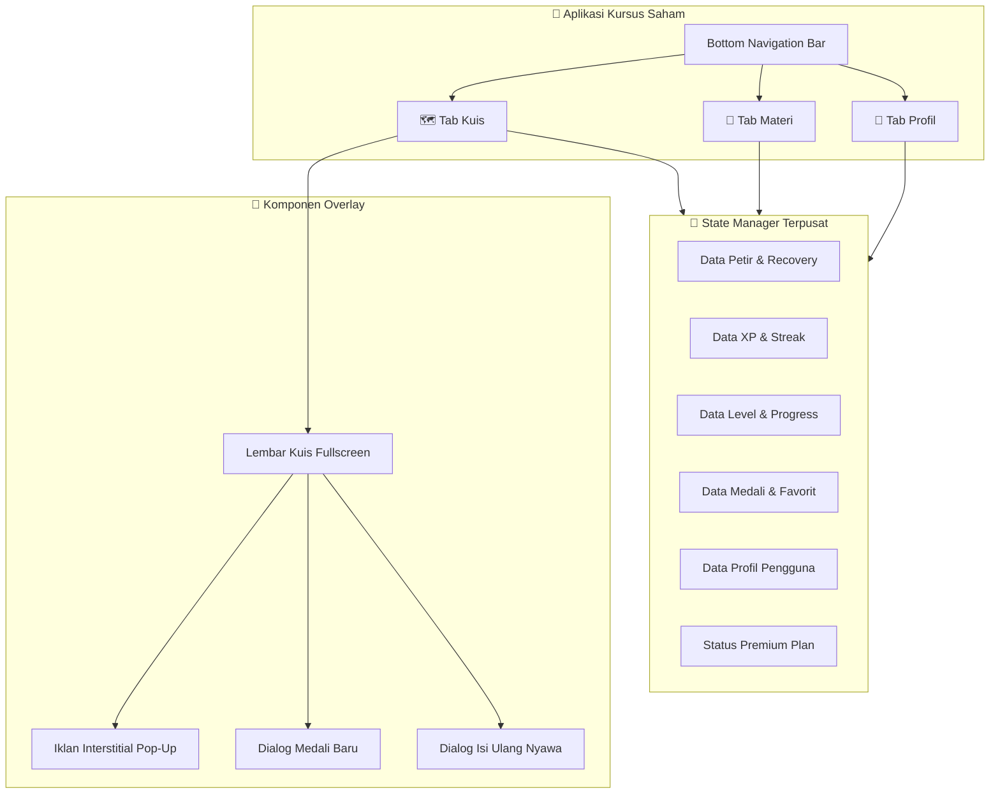
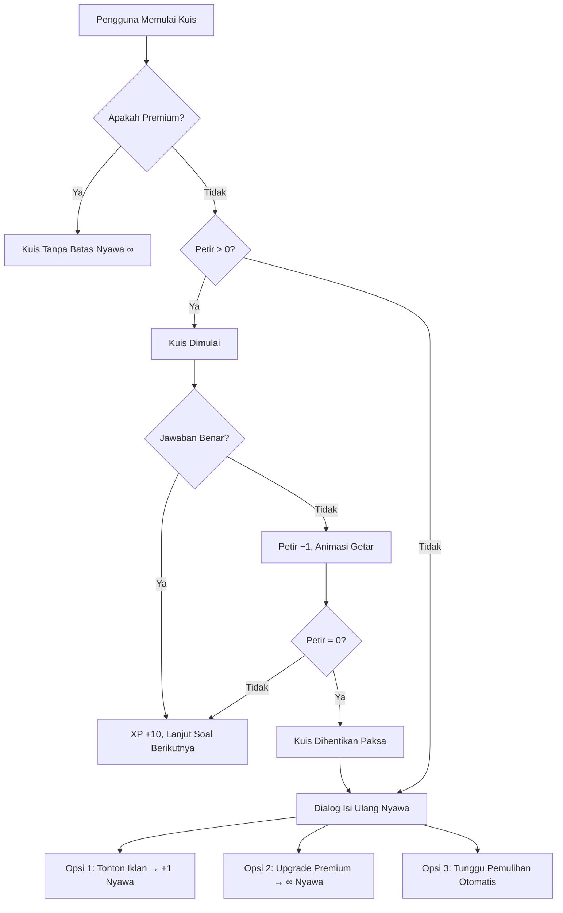
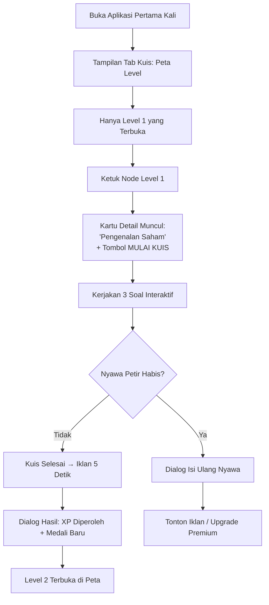
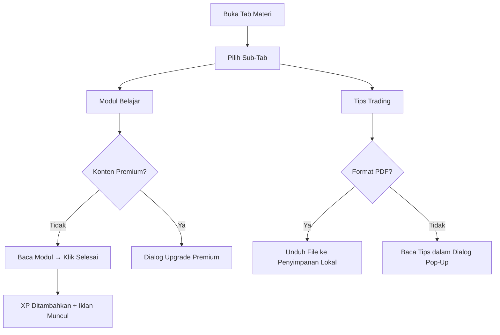

# BAB 2: SPESIFIKASI FITUR UTAMA APLIKASI

---

## 2.1 Gambaran Umum Arsitektur Fitur

Aplikasi Kursus Saham dirancang dengan pendekatan **modular**, di mana setiap fitur utama berdiri sebagai komponen mandiri namun saling terintegrasi melalui satu sistem manajemen data terpusat (*centralized state management*). Struktur navigasi aplikasi terbagi menjadi **3 modul utama** yang diakses melalui Bottom Navigation Bar di bagian bawah layar.

### Header Aplikasi (App Bar)
Di bagian atas layar, terdapat **bar indikator status** yang selalu terlihat di seluruh halaman, menampilkan:
- **Logo & Nama Aplikasi**: Ikon grafik saham hijau disertai judul halaman aktif.
- **Indikator Nyawa Petir**: Menampilkan jumlah nyawa tersisa (angka) atau simbol tak terbatas (∞) untuk pengguna Premium. Jika nyawa sedang dalam pemulihan, waktu hitung mundur ditampilkan di sampingnya.
- **Indikator Total XP**: Menampilkan akumulasi poin pengalaman pengguna secara real-time.

---

## 2.2 Modul 1: Sistem Kuis & Gamifikasi (Tab Kuis)

Tab Kuis merupakan **inti utama aplikasi** yang menguji pemahaman pengguna terhadap materi pasar modal melalui serangkaian kuis interaktif yang disusun dalam peta jalan visual bertingkat.

### 2.2.1 Peta Jalur Belajar (Learning Roadmap)

Peta jalur belajar ditampilkan secara vertikal dalam bentuk **node-node lingkaran yang saling terhubung oleh garis penghubung**, menyerupai sistem peta level pada aplikasi Duolingo. Pengguna menggulir layar ke bawah untuk melihat level selanjutnya.

**Spesifikasi Teknis Peta Level:**

| Aspek | Detail |
|---|---|
| Jumlah Level | 10 level kuis |
| Jumlah Soal per Level | 3 soal per level (total 30 soal) |
| Sistem Penguncian | Level N+1 terkunci hingga Level N diselesaikan |
| Pembagian Zona | 3 zona warna berbeda berdasarkan kategori materi |
| Tata Letak Node | Posisi zigzag (kiri–tengah–kanan) untuk variasi visual |
| Garis Penghubung | Garis putus-putus hijau (aktif) / garis solid abu-abu gelap (terkunci) |
| Interaksi Node | Ketuk node → muncul kartu detail level (deskripsi + tombol mulai kuis) |

**Pembagian Zona Materi:**

| Zona | Nama Zona | Warna | Level | Topik yang Dibahas |
|---|---|---|---|---|
| 1 | Pondasi Utama | Merah Tua (*Maroon*) | 1–3 | Pengenalan Saham, Bursa Efek, Fundamental Awal |
| 2 | Analisis Teknikal | Merah (*Red*) | 4–7 | Candlestick Dasar, Support & Resistance, Trendlines, Indikator Dasar |
| 3 | Manajemen Risiko | Merah Muda (*Rose*) | 8–10 | Money Management, Psikologi Trading, Cut Loss vs Take Profit |

**Daftar Lengkap 10 Level Kuis:**

| Level | Judul | Deskripsi Singkat |
|---|---|---|
| 1 | Pengenalan Saham | Pahami konsep dasar kepemilikan modal dan inflasi |
| 2 | Bursa Efek | Kenali institusi tempat perdagangan efek berlangsung |
| 3 | Fundamental Awal | Analisis kesehatan keuangan dasar emiten saham |
| 4 | Candlestick Dasar | Belajar memahami pergerakan harga melalui grafik lilin |
| 5 | Support & Resistance | Menentukan batas atas dan bawah psikologis harga saham |
| 6 | Trendlines | Membaca arah tren pasar saham |
| 7 | Indikator Dasar | Menggunakan alat bantu visual matematis untuk trading |
| 8 | Money Management | Lindungi modal trading Anda dari kebangkrutan |
| 9 | Psikologi Trading | Kuasai emosi FOMO dan serakah saat trading |
| 10 | Cut Loss vs Take Profit | Ketahui kapan harus mengunci profit dan memotong kerugian |

### 2.2.2 Sistem Nyawa Petir (Life System)

Sistem nyawa petir adalah mekanisme utama yang **membatasi jumlah kesalahan** yang diperbolehkan saat mengerjakan kuis, sekaligus menjadi penggerak utama konversi pengguna gratis ke Premium Plan.

**Alur Kerja Sistem Nyawa Petir:**

**Spesifikasi Teknis Sistem Petir:**

| Parameter | Nilai |
|---|---|
| Kapasitas Maksimal Nyawa | 5 Petir |
| Pengurangan per Jawaban Salah | −1 Petir |
| Waktu Pemulihan Otomatis | 1 Petir per 60 detik (1 menit) |
| Pemulihan via Iklan | +1 Petir per tayangan iklan 5 detik |
| Pengguna Premium | Nyawa tidak terbatas (simbol ∞), tanpa pengurangan |
| Persistensi Data | Waktu penggunaan terakhir disimpan secara lokal untuk kalkulasi pemulihan yang akurat meskipun aplikasi ditutup |

### 2.2.3 Lembar Kuis Interaktif (Quiz Overlay)

Ketika pengguna mengetuk tombol "Mulai Kuis" pada kartu detail level, layar kuis akan ditampilkan secara **fullscreen** menggantikan seluruh tampilan aplikasi.

**Komponen Antarmuka Layar Kuis:**

| Komponen | Fungsi |
|---|---|
| **Progress Bar** | Batang progres hijau horizontal di bagian atas yang menunjukkan posisi soal saat ini dari total jumlah soal dalam level tersebut |
| **Indikator Nyawa** | Tampilan jumlah petir tersisa di pojok kanan atas |
| **Label Tipe Soal** | Penanda kuning bertuliskan "PILIHAN GANDA" atau "ISI JAWABAN (ESAI)" |
| **Teks Pertanyaan** | Pertanyaan utama ditampilkan dalam ukuran huruf besar dan tebal agar mudah dibaca |
| **Area Jawaban** | Tombol-tombol pilihan (untuk pilgan) atau kotak input teks (untuk esai) |
| **Tombol Favorit** | Ikon bintang (☆/★) di bawah area jawaban untuk menyimpan soal ke daftar favorit |
| **Tombol Periksa/Lanjut** | Tombol aksi utama: "PERIKSA JAWABAN" saat belum diperiksa, berubah menjadi "LANJUTKAN" setelah diperiksa |
| **Panel Feedback** | Panel hijau (benar) atau merah (salah) yang muncul dari bawah layar, berisi penjelasan edukatif lengkap |
| **Tombol Keluar** | Ikon silang (✕) di pojok kiri atas, menampilkan dialog konfirmasi sebelum keluar |

**Tipe Pertanyaan yang Didukung:**

1. **Pilihan Ganda (Multiple Choice)**
   - Menampilkan 4 opsi jawaban dalam bentuk tombol terpisah.
   - Pengguna mengetuk salah satu opsi, opsi terpilih diberi highlight hijau.
   - Setelah dikunci, jawaban yang benar ditampilkan bersama penjelasan.

2. **Isian Esai Singkat (Short Answer)**
   - Menampilkan kotak input teks kosong.
   - Pengguna mengetik jawaban secara mandiri (case-insensitive).
   - Jawaban dicocokkan dengan kata kunci yang benar.

**Umpan Balik & Animasi:**

| Kondisi | Respons Aplikasi |
|---|---|
| Jawaban **benar** | Panel hijau muncul dari bawah dengan ikon ✓, teks "Jawaban Benar! (+10 XP)", dan penjelasan edukatif |
| Jawaban **salah** | Panel merah muncul dari bawah dengan ikon ✗, seluruh layar **bergetar (shake animation)**, nyawa petir berkurang 1, dan penjelasan jawaban yang benar ditampilkan |
| Kuis **selesai** | Dialog hasil akhir muncul: menampilkan jumlah jawaban benar, total XP diperoleh, dan jumlah nyawa tersisa |

### 2.2.4 Peti Medali Bonus (Bonus Chest)

Di bagian paling bawah peta level, terdapat elemen visual **Peti Medali Bonus** berornamen emas yang menjadi insentif bagi pengguna untuk menyelesaikan seluruh 10 level. Peti ini hanya dapat diklaim setelah semua level telah diselesaikan, dan akan memberikan medali eksklusif "🎓 Pakar Saham".

---

## 2.3 Modul 2: Pusat Edukasi & Referensi (Tab Materi)

Tab Materi berfungsi sebagai **perpustakaan digital** yang menyediakan konten edukasi tertulis dan referensi cepat. Tab ini dibagi menjadi **4 sub-tab** yang diakses melalui tab bar horizontal di bagian atas layar.

### 2.3.1 Sub-Tab: Modul Belajar

Modul belajar berisi **artikel-artikel edukasi terstruktur** yang disusun dari topik dasar hingga tingkat lanjut.

**Daftar Modul Belajar:**

| No | Judul Modul | Kategori | XP | Akses |
|---|---|---|---|---|
| 1 | Pengenalan Investasi Saham | Saham Pemula | +5 XP | Gratis |
| 2 | Cara Membeli Saham Pertama Anda | Panduan Praktis | +5 XP | Gratis |
| 3 | Membaca Laporan Keuangan Sederhana | Fundamental | +5 XP | Gratis |
| 4 | Pengenalan Grafik Candlestick | Teknikal | +5 XP | Gratis |
| 5 | Rahasia Sukses Day Trading Saham | Eksklusif Trading | +10 XP | 🔒 Premium |
| 6 | Psikologi Trader Profesional | Eksklusif Trading | +10 XP | 🔒 Premium |

**Spesifikasi Antarmuka Modul:**

| Elemen | Detail |
|---|---|
| Kartu Modul | Menampilkan badge kategori, judul, deskripsi singkat, dan reward XP |
| Status Pembacaan | Badge berubah menjadi "✓ Selesai dibaca" setelah modul dikonsumsi |
| Konten Premium | Ditandai badge kuning "PREMIUM EXCLUSIVE" dan ikon gembok 🔒 |
| Dialog Baca | Modul dibuka dalam dialog fullscreen scrollable dengan tombol "SELESAI MEMBACA (+XP)" |
| Iklan Pasca-Baca | Iklan interstitial ditampilkan setelah pengguna menyelesaikan pembacaan modul |

### 2.3.2 Sub-Tab: Favorit Anda

Menampilkan daftar **soal-soal kuis yang telah di-bookmark** oleh pengguna melalui ikon bintang pada layar kuis. Fitur ini memungkinkan pengguna untuk mengulang-ulang mempelajari soal yang dianggap sulit.

| Aspek | Detail |
|---|---|
| Tampilan | Daftar kartu berisi teks pertanyaan lengkap |
| Interaksi | Ketuk ikon bintang kuning (★) pada kartu untuk menghapus dari daftar favorit |
| Status Kosong | Jika belum ada favorit, ditampilkan ikon bintang besar dengan pesan "Belum ada soal kuis favorit" |

### 2.3.3 Sub-Tab: Tips Trading

Menampilkan kumpulan **tips dan strategi trading praktis** yang disusun oleh tim konten. Beberapa tips tersedia dalam format dokumen PDF yang dapat diunduh.

**Daftar Tips Trading:**

| No | Judul Tips | Kategori | Format | Akses |
|---|---|---|---|---|
| 1 | Panduan Manajemen Risiko 2% | Manajemen Risiko | 📄 PDF | Gratis |
| 2 | Cara Memilih Saham Blue Chip | Investasi | 💡 Artikel | Gratis |
| 3 | Mengatasi FOMO & Serakah | Psikologi | 💡 Artikel | Gratis |
| 4 | Strategi Swing Trading Eksklusif | Strategi Trading | 📄 PDF | 🔒 Premium |

**Spesifikasi Antarmuka Tips:**

| Elemen | Detail |
|---|---|
| Kartu Tips | Dilengkapi header visual bergradien (merah untuk PDF, biru-hijau untuk artikel) |
| Badge Premium | Label kuning "PREMIUM" di pojok kanan atas kartu untuk konten terkunci |
| Tombol Aksi | "Unduh PDF" (menyimpan file ke penyimpanan lokal) atau "Baca Tips" (membuka dialog) |
| Konten Terkunci | Mengarahkan pengguna ke dialog upgrade Premium Plan |

### 2.3.4 Sub-Tab: Kamus Istilah Pasar Modal

Menyediakan **ensiklopedia ringkas istilah-istilah penting** yang lazim digunakan di dunia pasar modal Indonesia.

**Daftar Istilah yang Tersedia (Versi Awal):**

| Istilah | Definisi Singkat |
|---|---|
| Bullish | Tren pasar/harga saham sedang naik secara konsisten |
| Bearish | Tren pasar/harga saham sedang turun |
| Dividen | Bagian keuntungan perusahaan yang dibagikan ke pemegang saham |
| IPO | Penawaran perdana saham perusahaan ke publik |
| Lot | Satuan perdagangan saham (1 lot = 100 lembar) |
| Blue Chip | Saham lapis satu berkapitalisasi besar dan likuid |
| IHSG | Indeks Harga Saham Gabungan di BEI |
| Capital Gain | Keuntungan dari selisih harga jual dan beli saham |

**Spesifikasi Antarmuka Kamus:**

| Elemen | Detail |
|---|---|
| Kotak Pencarian | Filter instan di bagian atas — hasil terfilter secara real-time saat pengguna mengetik |
| Kartu Istilah | Format *expandable accordion* — ketuk untuk membuka/menutup definisi lengkap |
| Contoh Penggunaan | Setiap istilah dilengkapi contoh kalimat penggunaan dalam konteks nyata |
| Tombol Suara | Ikon speaker (🔊) untuk mengucapkan istilah menggunakan fitur Text-to-Speech |
| Highlight Aktif | Kartu yang sedang terbuka diberi border hijau untuk indikasi visual |

---

## 2.4 Modul 3: Akun Pengguna & Pencapaian (Tab Profil / Saya)

Tab Profil menampilkan **identitas pengguna, statistik kemajuan belajar, status langganan, dan koleksi medali pencapaian** dalam satu halaman yang dapat di-scroll.

### 2.4.1 Kartu Identitas Pengguna

| Elemen | Detail |
|---|---|
| Avatar | Emoji besar yang dapat dikustomisasi (tersedia 9 pilihan: 📈📉🦁🐻💰👑🚀📊🎯) |
| Nama Pengguna | Teks nama yang dapat diedit melalui dialog input |
| Email | Alamat email pengguna yang dapat diedit |
| Border Avatar | Gradien hijau untuk pengguna gratis, gradien emas untuk pengguna Premium |
| Tombol Edit | Ikon pensil kecil di pojok bawah avatar untuk memicu dialog ubah profil |

### 2.4.2 Kartu Status Langganan (Premium Plan)

Kartu interaktif yang menampilkan status langganan pengguna saat ini:

| Status | Tampilan | Interaksi |
|---|---|---|
| **Gratis** | Teks "GRATIS PLAN" dengan border kuning dan tombol "UPGRADE" | Ketuk → membuka dialog penawaran Premium Plan |
| **Premium** | Teks "PREMIUM PLAN" dengan deskripsi "Petir tak terbatas, bebas iklan, modul terbuka" | Tidak ada interaksi (sudah aktif) |

### 2.4.3 Dashboard Statistik Belajar

Grid 2×2 yang menampilkan **4 metrik utama kemajuan belajar pengguna** secara ringkas:

| Metrik | Keterangan | Contoh Nilai |
|---|---|---|
| **Total XP** | Akumulasi seluruh poin pengalaman yang pernah diperoleh (berwarna emas) | 250 |
| **XP Hari Ini** | Poin yang diperoleh hari ini terhadap target harian | 30 / 50 |
| **Streak Belajar** | Jumlah hari berturut-turut pengguna aktif mengerjakan kuis/membaca materi | 5 hari |
| **Level Selesai** | Rasio jumlah level kuis yang telah diselesaikan | 4 / 10 |

### 2.4.4 Rak Medali Pencapaian (Badges Grid)

Grid 4 kolom yang menampilkan seluruh **medali pencapaian** yang dapat diraih oleh pengguna. Medali yang belum terbuka ditampilkan dalam keadaan redup (opacity 40%).

**Daftar Lengkap Medali & Syarat Pembukaan:**

| Ikon | Nama Medali | Syarat Pembukaan Kunci | Tingkat Kesulitan |
|---|---|---|---|
| 🌱 | Saham Pemula | Menyelesaikan kuis level pertama (Level 1) | ⭐ Mudah |
| 🛡️ | Anti Boncos | Menyelesaikan **satu kuis level apapun** dengan jawaban 100% benar (tanpa satu pun salah) | ⭐⭐⭐ Sulit |
| 🔥 | Investor Setia | Mencapai **streak belajar minimal 3 hari** berturut-turut | ⭐⭐ Sedang |
| 📚 | Kolektor Ilmu | Menyimpan **minimal 3 soal** ke daftar favorit | ⭐ Mudah |
| 👑 | Premium Member | Mengaktifkan langganan **Premium Plan** | ⭐ Mudah |
| 🎓 | Pakar Saham | Menyelesaikan **seluruh 10 level** kuis dari awal hingga akhir | ⭐⭐⭐ Sulit |

**Interaksi Medali:**
- Ketuk medali mana pun → membuka dialog detail yang menampilkan ikon besar, nama medali, deskripsi syarat pembukaan, dan status terbuka/terkunci.
- Ketika medali baru berhasil dibuka, aplikasi secara otomatis menampilkan **dialog animasi perayaan** bertuliskan "🏆 Medali Didapatkan!" dengan tombol konfirmasi "HEBAT!".

---

## 2.5 Modul 4: Sistem Monetisasi

### 2.5.1 Iklan Interstitial (Pengguna Gratis)

Iklan interstitial adalah **layar iklan fullscreen sementara** yang muncul pada momen-momen transisi tertentu dalam aplikasi.

**Momen Penayangan Iklan:**

| Pemicu | Konteks |
|---|---|
| Selesai mengerjakan kuis | Iklan muncul setelah kuis selesai, sebelum dialog hasil akhir ditampilkan |
| Selesai membaca modul | Iklan muncul setelah pengguna menekan tombol "Selesai Membaca" |
| Isi ulang nyawa | Pengguna secara sukarela menonton iklan 5 detik untuk mendapatkan +1 nyawa petir |

**Spesifikasi Layar Iklan:**

| Elemen | Detail |
|---|---|
| Durasi | 5 detik (hitung mundur ditampilkan di pojok kanan atas) |
| Konten Visual | Simulasi iklan broker saham dengan animasi grafik pergerakan harga saham real-time (digambar menggunakan custom canvas painter) |
| Tombol Tutup | Tombol "✕ Tutup Iklan" hanya muncul setelah hitungan mundur mencapai 0 detik |
| Pencegahan Dismiss | Layar iklan tidak dapat ditutup dengan tombol back atau gesture swipe selama hitungan mundur berjalan |
| Pengecualian | Iklan **tidak pernah ditampilkan** kepada pengguna Premium Plan |

### 2.5.2 Premium Subscription Plan

Premium Plan adalah paket berlangganan berbayar yang memberikan **akses tanpa batas** dan pengalaman belajar bebas gangguan.

**Perbandingan Fitur Gratis vs Premium:**

| Fitur | Gratis | 👑 Premium |
|---|---|---|
| Jumlah Level Kuis | 10 Level (Penuh) | 10 Level (Penuh) |
| Nyawa Petir | 5 Nyawa (habis = menunggu/iklan) | ∞ Tidak Terbatas |
| Iklan Pop-Up | Ya (setiap selesai kuis/materi) | Tidak Ada |
| Modul Belajar Dasar | Terbuka | Terbuka |
| Modul Eksklusif | 🔒 Terkunci | ✅ Terbuka Penuh |
| PDF Tips Trading Premium | 🔒 Terkunci | ✅ Bebas Unduh |
| Medali "Premium Member" | 🔒 Tidak Tersedia | ✅ Otomatis Diberikan |
| Border Avatar Profil | Gradien Hijau | Gradien Emas Eksklusif |

**Spesifikasi Dialog Penawaran Premium:**

| Elemen | Detail |
|---|---|
| Pemicu Tampil | Ketuk kartu "Upgrade" di halaman profil, atau ketuk konten terkunci di tab materi |
| Daftar Keuntungan | 4 poin keunggulan dengan ikon visual (⚡🚫🔒📄) |
| Harga Tampilan | Harga coret (Rp 150.000/bulan) dan harga promo (Rp 49.000/selamanya) |
| Tombol Aksi | Tombol emas "BAYAR SEKARANG (SIMULASI)" |
| Catatan | Pembayaran saat ini bersifat simulasi. Integrasi payment gateway riil dapat ditambahkan di fase pengembangan berikutnya. |

---

## 2.6 Alur Pengguna Utama (Primary User Flows)

Berikut adalah diagram alur pengalaman utama yang akan dilalui oleh pengguna saat menggunakan aplikasi:

### 2.6.1 Alur: Pengguna Baru Pertama Kali

### 2.6.2 Alur: Pengguna Membaca Materi & Unduh PDF

---

## 2.7 Ringkasan Jumlah Konten Aplikasi (Versi Awal)

| Kategori Konten | Jumlah |
|---|---|
| Level Kuis | 10 level |
| Total Soal Kuis (Pilgan + Esai) | 30 soal |
| Modul Belajar | 6 modul (4 gratis + 2 premium) |
| Tips Trading | 4 artikel/PDF (3 gratis + 1 premium) |
| Istilah Kamus | 8 istilah pasar modal |
| Medali Pencapaian | 6 medali |
| Pilihan Avatar Profil | 9 emoji |

> [!NOTE]
> Seluruh jumlah konten di atas merupakan **konten versi awal (MVP — Minimum Viable Product)** yang telah tertanam di dalam kode aplikasi. Penambahan soal kuis, modul materi, istilah kamus, dan medali baru dapat dilakukan dengan mudah melalui pembaruan kode tanpa perlu merombak arsitektur aplikasi.

---

> [!IMPORTANT]
> Bab ini menjelaskan **apa yang akan dibangun** secara fungsional. Untuk penjelasan **bagaimana sistem ini dibangun** secara teknis (arsitektur, framework, dan manajemen data), silakan merujuk ke **Bab 3: Rancangan Teknologi & Arsitektur Sistem**.
