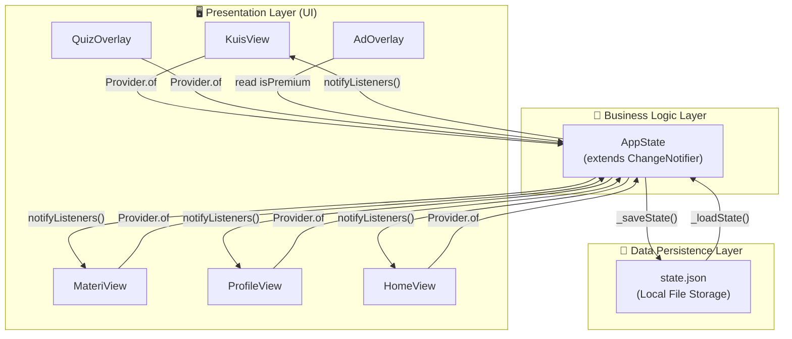
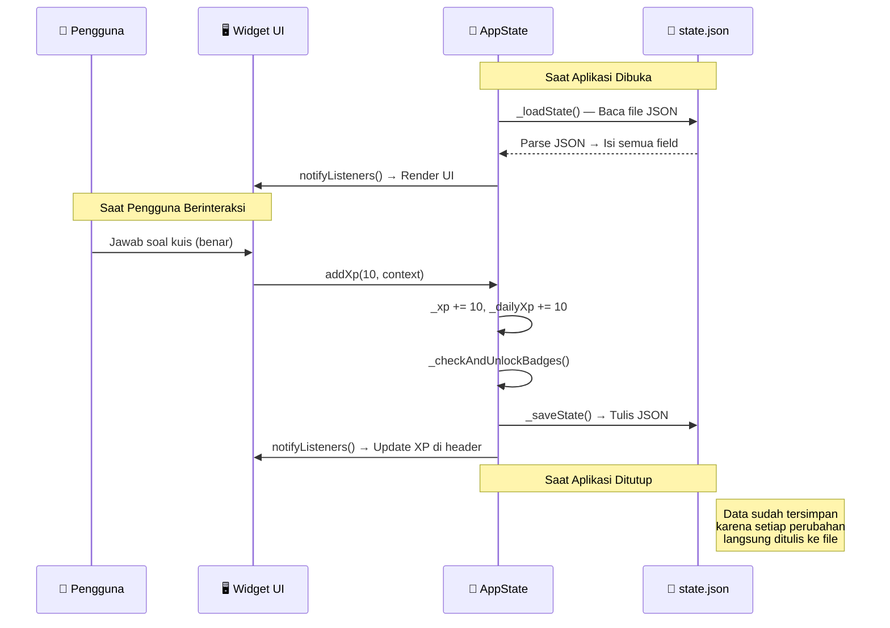
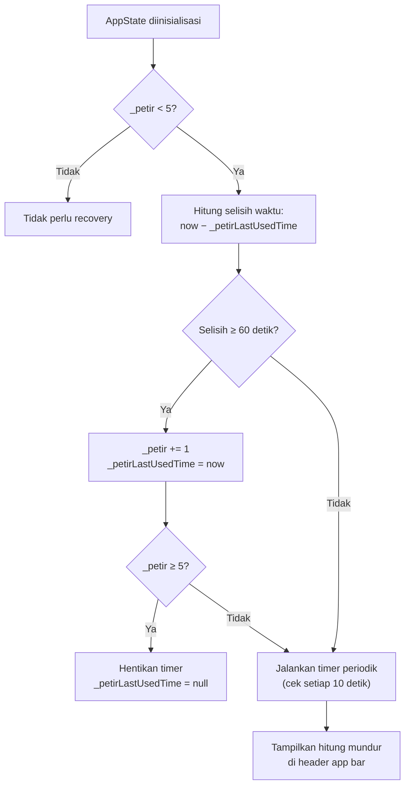

# BAB 3: RANCANGAN TEKNOLOGI & ARSITEKTUR SISTEM

---

## 3.1 Pemilihan Teknologi Utama

### 3.1.1 Framework Pengembangan: Flutter (Dart)

Aplikasi Kursus Saham dikembangkan menggunakan framework **Flutter** yang dikembangkan oleh Google, dengan bahasa pemrograman **Dart**. Flutter dipilih karena memenuhi kebutuhan utama proyek ini, yaitu membangun **aplikasi mobile native murni** (bukan web yang di-wrap) untuk dua platform sekaligus dalam satu basis kode.

**Profil Teknologi:**

| Aspek | Detail |
|---|---|
| Framework | Flutter SDK (Stable Channel) |
| Bahasa Pemrograman | Dart 3.13+ |
| Versi SDK | Flutter 3.47.x |
| Platform Target | Android (API 21+), iOS (14.0+) |
| Rendering Engine | Impeller (Android & iOS) / Skia (fallback) |
| Paradigma UI | Widget-based Declarative UI |
| Lisensi | BSD 3-Clause (Open Source, gratis komersial) |

### 3.1.2 Justifikasi Pemilihan Flutter

Berikut adalah analisis perbandingan teknologi yang mendasari pemilihan Flutter sebagai framework pengembangan:

| Kriteria | Flutter | React Native | Native (Kotlin + Swift) |
|---|---|---|---|
| **Basis Kode** | 1 kode untuk Android & iOS | 1 kode untuk Android & iOS | 2 kode terpisah |
| **Performa UI** | ⭐⭐⭐ Native-level (60-120 FPS), rendering langsung ke GPU | ⭐⭐ Mendekati native, bridge JS | ⭐⭐⭐ Performa terbaik |
| **Konsistensi Visual** | ⭐⭐⭐ Pixel-perfect di semua perangkat | ⭐⭐ Bergantung komponen native OS | ⭐⭐ Berbeda per platform |
| **Kecepatan Pengembangan** | ⭐⭐⭐ Hot Reload, widget library bawaan kaya | ⭐⭐⭐ Hot Reload, ekosistem JS luas | ⭐ Lambat (dua basis kode) |
| **Biaya Pengembangan** | ⭐⭐⭐ Hemat (1 tim developer) | ⭐⭐⭐ Hemat (1 tim developer) | ⭐ Mahal (2 tim developer) |
| **Custom Animation** | ⭐⭐⭐ Canvas API langsung, CustomPainter | ⭐⭐ Terbatas, perlu native modules | ⭐⭐⭐ Penuh |
| **Dukungan Google** | ⭐⭐⭐ Didukung langsung oleh Google | ⭐⭐ Didukung oleh Meta | ⭐⭐⭐ Vendor masing-masing |

> [!IMPORTANT]
> Flutter dipilih karena memberikan **keseimbangan terbaik** antara performa native, biaya pengembangan yang efisien, dan kemampuan custom animation (yang sangat dibutuhkan untuk menggambar peta level zigzag dan grafik iklan saham menggunakan `CustomPainter`).

### 3.1.3 Dependensi Library Pihak Ketiga

Aplikasi ini dirancang dengan prinsip **minimal dependency** — hanya menggunakan library eksternal yang benar-benar esensial untuk mengurangi risiko konflik versi dan menjaga ukuran file aplikasi tetap ringan.

| Library | Versi | Fungsi | Lisensi |
|---|---|---|---|
| `provider` | ^6.1.1 | State management terpusat berbasis `ChangeNotifier` | MIT |
| `path_provider` | ^2.1.2 | Mengakses direktori penyimpanan aplikasi di Android/iOS | BSD-3 |
| `cupertino_icons` | ^1.0.6 | Ikon bergaya iOS untuk konsistensi lintas platform | MIT |

> [!TIP]
> Dengan hanya **3 library eksternal**, aplikasi memiliki footprint yang sangat kecil dan minim risiko breaking changes saat pembaruan Flutter SDK di masa depan.

---

## 3.2 Arsitektur Sistem Aplikasi

### 3.2.1 Pola Arsitektur: Provider + ChangeNotifier

Aplikasi menggunakan pola arsitektur **Provider Pattern** yang merupakan pendekatan state management resmi yang direkomendasikan oleh tim Flutter untuk aplikasi skala kecil hingga menengah.



**Penjelasan Alur Data:**

1. **Presentation Layer** — Seluruh widget tampilan (`View` dan `Overlay`) membaca data dari `AppState` melalui mekanisme `Provider.of<AppState>(context)`. Widget secara otomatis di-rebuild ketika data berubah.

2. **Business Logic Layer** — Kelas `AppState` (extends `ChangeNotifier`) berisi seluruh logika bisnis: pengelolaan petir, perhitungan XP, pembukaan medali, pemeriksaan streak, dan kontrol premium. Setiap perubahan data memanggil `notifyListeners()` untuk memperbarui UI secara reaktif.

3. **Data Persistence Layer** — Setiap kali terjadi perubahan state, data secara otomatis diserialisasi ke dalam format JSON dan ditulis ke file `state.json` di direktori aplikasi yang aman. Saat aplikasi dibuka kembali, file ini dibaca untuk memulihkan seluruh state terakhir.

### 3.2.2 Diagram Struktur Direktori Kode Sumber

```
d:\Kursus-Saham\
│
├── lib/                              ← Kode sumber Dart utama
│   ├── main.dart                     ← Entry point aplikasi & konfigurasi tema
│   │
│   ├── state/
│   │   └── app_state.dart            ← State manager terpusat (ChangeNotifier)
│   │
│   ├── views/
│   │   ├── home_view.dart            ← Shell navigasi bawah (Bottom Nav)
│   │   ├── kuis_view.dart            ← Peta level zigzag + bank soal kuis
│   │   ├── materi_view.dart          ← Modul belajar, favorit, tips, kamus
│   │   └── profile_view.dart         ← Profil pengguna, statistik, medali
│   │
│   └── widgets/
│       ├── quiz_overlay.dart         ← Lembar kuis fullscreen interaktif
│       └── ad_overlay.dart           ← Layar iklan interstitial 5 detik
│
├── android/                          ← Konfigurasi native Android (Gradle)
├── ios/                              ← Konfigurasi native iOS (Xcode)
├── test/                             ← Unit test & widget test
├── pubspec.yaml                      ← Manifest dependensi & aset
└── analysis_options.yaml             ← Konfigurasi linter kode
```

---

## 3.3 Model Data & Penyimpanan Lokal

### 3.3.1 Skema Data AppState

Seluruh state aplikasi dikelola dalam satu objek `AppState` yang menyimpan data berikut:

| Field | Tipe Data | Nilai Default | Deskripsi |
|---|---|---|---|
| `_petir` | `int` | `5` | Jumlah nyawa petir tersisa |
| `_petirLastUsedTime` | `int?` | `null` | Timestamp epoch (ms) saat petir terakhir digunakan, untuk kalkulasi pemulihan |
| `_xp` | `int` | `0` | Total akumulasi poin pengalaman |
| `_dailyXp` | `int` | `0` | Poin XP yang dikumpulkan pada hari ini |
| `_streak` | `int` | `0` | Jumlah hari berturut-turut pengguna aktif belajar |
| `_lastActiveDate` | `String` | `""` | Tanggal aktivitas terakhir (format `yyyy-MM-dd`) |
| `_completedLevels` | `List<int>` | `[]` | Daftar ID level kuis yang telah diselesaikan |
| `_unlockedBadges` | `List<String>` | `[]` | Daftar ID medali yang telah terbuka |
| `_favorites` | `List<Map>` | `[]` | Daftar soal favorit (`{levelId, qIndex, questionText}`) |
| `_readModules` | `List<int>` | `[]` | Daftar ID modul materi yang telah selesai dibaca |
| `_isPremium` | `bool` | `false` | Status berlangganan Premium Plan |
| `_userName` | `String` | `"Investor Pemula"` | Nama tampilan pengguna |
| `_userEmail` | `String` | `"email@example.com"` | Alamat email pengguna |
| `_userAvatar` | `String` | `"📈"` | Emoji avatar profil yang dipilih |

### 3.3.2 Format Penyimpanan: JSON Lokal

Data disimpan dalam file teks berformat **JSON** di direktori dokumen aplikasi yang dilindungi oleh sistem operasi (sandbox).

**Contoh Isi File `state.json`:**

```json
{
  "petir": 3,
  "petirLastUsedTime": 1724389200000,
  "xp": 180,
  "dailyXp": 40,
  "streak": 5,
  "lastActiveDate": "2026-08-23",
  "completedLevels": [1, 2, 3, 4],
  "unlockedBadges": ["saham_pemula", "investor_setia"],
  "favorites": [
    { "levelId": 2, "qIndex": 0, "questionText": "Apa singkatan resmi dari Bursa Efek Indonesia?" },
    { "levelId": 5, "qIndex": 1, "questionText": "Ketika harga saham mendekati area Resistance..." }
  ],
  "readModules": [1, 2, 3],
  "isPremium": false,
  "userName": "Budi Santoso",
  "userEmail": "budi@email.com",
  "userAvatar": "🦁"
}
```

**Lokasi Penyimpanan per Platform:**

| Platform | Lokasi Direktori | Keamanan |
|---|---|---|
| **Android** | `/data/data/com.kursussaham.kursus_saham/app_flutter/` | Sandbox — hanya dapat diakses oleh aplikasi ini, tidak terlihat oleh file manager biasa |
| **iOS** | `NSDocumentDirectory` (container aplikasi) | Sandbox — dilindungi oleh iOS App Sandbox |

### 3.3.3 Siklus Hidup Data (Data Lifecycle)



---

## 3.4 Sistem Pemulihan Nyawa Petir (Timer Recovery)

Mekanisme pemulihan nyawa petir menggunakan **timer berbasis waktu riil** yang berjalan independen di dalam `AppState`.

### 3.4.1 Algoritma Pemulihan



### 3.4.2 Spesifikasi Teknis Timer

| Parameter | Nilai |
|---|---|
| Interval pemeriksaan | Setiap 10 detik (`Timer.periodic`) |
| Durasi pemulihan per 1 nyawa | 60 detik (1 menit) |
| Persistensi waktu | `_petirLastUsedTime` disimpan ke JSON, sehingga pemulihan tetap akurat meskipun aplikasi ditutup dan dibuka kembali |
| Tampilan UI | Sisa waktu pemulihan ditampilkan dalam format detik di samping indikator petir di header |
| Pengguna Premium | Timer tidak aktif, nyawa selalu ∞ |

---

## 3.5 Rendering Grafis Kustom

Aplikasi ini memanfaatkan **Flutter Canvas API** (`CustomPainter`) untuk menggambar elemen visual yang tidak dapat dicapai dengan widget bawaan.

### 3.5.1 Daftar Custom Painter

| Custom Painter | Lokasi | Fungsi |
|---|---|---|
| `RoadmapLinePainter` | `kuis_view.dart` | Menggambar garis penghubung antar-node level pada peta kuis. Garis putus-putus hijau untuk jalur aktif, garis solid abu-abu untuk jalur terkunci. |
| `_ChartPainter` | `ad_overlay.dart` | Menggambar animasi grafik pergerakan harga saham (garis zigzag naik-turun) secara real-time pada layar iklan interstitial. |

### 3.5.2 Justifikasi Penggunaan CustomPainter

| Kebutuhan | Solusi Widget Biasa | Solusi CustomPainter |
|---|---|---|
| Garis zigzag antar-node | ❌ Tidak memungkinkan — widget `Line` tidak mendukung garis putus-putus diagonal antar koordinat bebas | ✅ `canvas.drawLine()` dengan perhitungan offset manual |
| Grafik saham animasi | ❌ Memerlukan library charting berat (fl_chart, syncfusion) yang menambah ukuran APK | ✅ Ringan, digambar langsung dari array data ke canvas |

---

## 3.6 Konfigurasi Tema & Desain Visual

### 3.6.1 Palet Warna Aplikasi

| Kode Warna | Nama | Penggunaan |
|---|---|---|
| `#0A0E17` | Navy Midnight | Warna latar utama scaffold |
| `#131A26` | Dark Slate | Warna kartu, dialog, dan app bar |
| `#1B2536` | Steel Blue | Warna elemen sekunder (badge, input field) |
| `#10B981` | Emerald Green | Aksen utama (tombol, progress bar, jawaban benar) |
| `#F59E0B` | Amber Gold | Aksen sekunder (XP, medali, Premium Plan) |
| `#EF4444` | Crimson Red | Nyawa petir, jawaban salah, peringatan |
| `#F43F5E` | Rose Pink | Zona 3 peta kuis (Manajemen Risiko) |
| `#9CA3AF` | Cool Gray | Teks sekunder, deskripsi, placeholder |
| `#6B7280` | Dim Gray | Teks non-aktif, ikon terkunci |

### 3.6.2 Tipografi

| Elemen | Font Family | Ukuran | Berat |
|---|---|---|---|
| Judul halaman / level | Outfit | 16–22px | Bold (700) |
| Teks pertanyaan kuis | Outfit | 22px | Bold (700) |
| Teks konten / deskripsi | Inter (default) | 12–14px | Regular (400) |
| Label badge / tag | Inter | 10–11px | Bold (700) |
| Angka statistik | Outfit | 20–22px | Bold (700) |

### 3.6.3 Prinsip Desain

| Prinsip | Implementasi |
|---|---|
| **Dark Theme Premium** | Seluruh aplikasi menggunakan skema warna gelap yang nyaman di mata dan memberikan kesan premium/eksklusif |
| **Hierarchy Visual** | Elemen penting (XP, petir, tombol aksi) diberi warna aksen cerah agar langsung menarik perhatian |
| **Feedback Instan** | Setiap interaksi pengguna (ketuk, jawab, bookmark) memberikan respons visual langsung (perubahan warna, animasi, snackbar) |
| **Progressive Disclosure** | Informasi detail disembunyikan di balik interaksi (ketuk node → kartu detail, ketuk istilah → accordion terbuka) untuk menghindari kelebihan informasi |

---

## 3.7 Kompatibilitas Platform & Persyaratan Minimum

### 3.7.1 Android

| Aspek | Spesifikasi |
|---|---|
| Versi Minimum | Android 5.0 (Lollipop, API Level 21) |
| Versi Target | Android 14 (API Level 34) |
| Arsitektur CPU | ARM 32-bit (armeabi-v7a), ARM 64-bit (arm64-v8a), x86_64 |
| Format Distribusi | `.apk` (sideload) dan `.aab` (Google Play Store) |
| Ukuran Estimasi APK | ~15–25 MB (tanpa aset gambar eksternal) |
| Izin yang Diperlukan | Tidak ada izin khusus (tanpa kamera, lokasi, atau internet wajib) |

### 3.7.2 iOS

| Aspek | Spesifikasi |
|---|---|
| Versi Minimum | iOS 14.0 |
| Versi Target | iOS 17+ |
| Arsitektur CPU | ARM 64-bit (arm64) |
| Format Distribusi | `.ipa` via Xcode → TestFlight → App Store Connect |
| Ukuran Estimasi | ~20–30 MB |
| Izin yang Diperlukan | Tidak ada izin khusus |

### 3.7.3 Matriks Kompatibilitas Perangkat

| Kategori Perangkat | Contoh | Status |
|---|---|---|
| Ponsel Android Budget | Samsung Galaxy A05, Redmi 12C, Realme C55 | ✅ Didukung |
| Ponsel Android Mid-Range | Samsung Galaxy A54, OPPO Reno 11, Xiaomi 13T | ✅ Didukung |
| Ponsel Android Flagship | Samsung Galaxy S24, Google Pixel 8, OnePlus 12 | ✅ Didukung |
| Tablet Android | Samsung Galaxy Tab A9, Xiaomi Pad 6 | ✅ Didukung (layout responsif) |
| iPhone | iPhone 8 dan seri lebih baru (iOS 14+) | ✅ Didukung |
| iPad | iPad Air 3 dan seri lebih baru | ✅ Didukung (layout responsif) |

---

## 3.8 Pertimbangan Keamanan

| Aspek Keamanan | Implementasi |
|---|---|
| **Penyimpanan Data** | File `state.json` disimpan di dalam direktori sandbox aplikasi yang tidak dapat diakses oleh aplikasi lain atau pengguna tanpa akses root/jailbreak |
| **Validasi Input** | Jawaban esai diproses dengan sanitasi lowercase dan trim untuk mencegah injeksi karakter tak terduga |
| **Integritas State** | Jika file `state.json` rusak atau tidak ditemukan, aplikasi melakukan fallback ke nilai default tanpa crash |
| **Proteksi Premium** | Status Premium disimpan secara lokal. Untuk produksi, disarankan validasi server-side di fase pengembangan berikutnya |
| **Obfuskasi Kode** | Saat kompilasi rilis (`flutter build apk --release`), Dart compiler secara otomatis melakukan tree-shaking dan obfuskasi untuk menyulitkan reverse engineering |

---

## 3.9 Rencana Pengembangan Lanjutan (Future Roadmap)

Arsitektur aplikasi telah dirancang agar **mudah diperluas** di masa depan. Berikut adalah fitur-fitur yang dapat ditambahkan tanpa perlu merombak fondasi kode:

| Fase | Fitur Pengembangan Lanjutan | Teknologi Tambahan |
|---|---|---|
| **Fase 2** | Backend cloud + sinkronisasi data antar perangkat | Firebase Firestore / Supabase |
| **Fase 2** | Autentikasi pengguna (login Google/Apple) | Firebase Auth |
| **Fase 2** | Integrasi payment gateway riil untuk Premium Plan | Midtrans / Stripe + Google Play Billing |
| **Fase 3** | Integrasi iklan riil | Google AdMob SDK |
| **Fase 3** | Push notification pengingat belajar harian | Firebase Cloud Messaging |
| **Fase 3** | Leaderboard global & sistem pertemanan | Firebase Realtime Database |
| **Fase 4** | Konten dinamis dari CMS (admin panel web) | REST API + Dashboard Admin |
| **Fase 4** | Analitik perilaku pengguna | Firebase Analytics / Mixpanel |

> [!NOTE]
> Seluruh fitur pada **Fase 2–4 bersifat opsional** dan tidak termasuk dalam ruang lingkup proyek saat ini. Masing-masing dapat dinegosiasikan sebagai proyek pengembangan tambahan secara terpisah sesuai kebutuhan dan anggaran client.

---

> [!IMPORTANT]
> Bab ini menjelaskan **bagaimana sistem dibangun** secara teknis. Untuk detail **jadwal pengerjaan dan estimasi biaya**, silakan merujuk ke **Bab 4: Jadwal Proyek & Estimasi Anggaran**.
