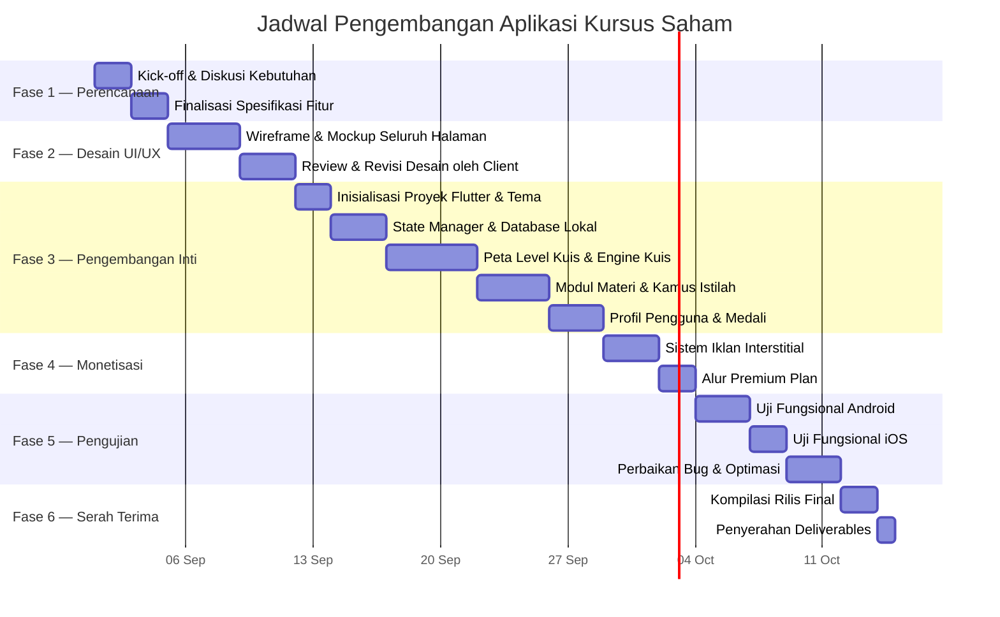

# BAB 4: JADWAL PROYEK & ESTIMASI ANGGARAN

---

## 4.1 Ringkasan Jadwal Proyek

Proyek pengembangan aplikasi Kursus Saham direncanakan berlangsung selama **6–8 minggu kalender** (30–40 hari kerja efektif), terhitung sejak tanggal persetujuan proposal dan pembayaran termin pertama oleh client.

**Asumsi Perencanaan:**

| Parameter | Nilai |
|---|---|
| Hari kerja per minggu | 5 hari (Senin–Jumat) |
| Jam kerja efektif per hari | 6–8 jam |
| Jumlah developer | 1 orang (Full-Stack Flutter Developer) |
| Metode koordinasi | WhatsApp / Telegram untuk update harian, Google Meet untuk review mingguan |
| Metode revisi | Maksimal 2 putaran revisi per fase tanpa biaya tambahan |

---

## 4.2 Diagram Jadwal Proyek (Gantt Chart)

---

## 4.3 Rincian Fase Pengembangan

### Fase 1: Perencanaan & Analisis Kebutuhan

| Aspek | Detail |
|---|---|
| **Durasi** | 3–5 hari kerja |
| **Aktivitas** | Kick-off meeting bersama client, diskusi mendalam mengenai kebutuhan fitur, finalisasi daftar spesifikasi, penentuan prioritas konten (bank soal, modul materi, istilah kamus). |
| **Output** | Dokumen spesifikasi fitur final yang telah disetujui kedua belah pihak. |
| **Peran Client** | Menyediakan waktu diskusi, menyetujui daftar fitur final, dan menyerahkan konten awal (jika ada). |

**Milestone Fase 1:**

- [x] Kick-off meeting terlaksana
- [x] Daftar fitur final disetujui oleh client
- [x] Konten bank soal & materi awal diterima dari client (atau disepakati menggunakan konten bawaan developer)

---

### Fase 2: Desain UI/UX

| Aspek | Detail |
|---|---|
| **Durasi** | 5–7 hari kerja |
| **Aktivitas** | Perancangan wireframe low-fidelity, pembuatan mockup high-fidelity seluruh halaman utama (Kuis, Materi, Profil, Kuis Overlay, Iklan, Dialog Medali), pemilihan palet warna & tipografi, serta presentasi desain ke client untuk review. |
| **Output** | File mockup visual seluruh halaman aplikasi dalam format gambar (PNG/PDF). |
| **Peran Client** | Memberikan feedback desain, menyetujui tampilan final sebelum masuk tahap pemrograman. |

**Milestone Fase 2:**

- [ ] Wireframe seluruh halaman selesai
- [ ] Mockup high-fidelity disetujui oleh client
- [ ] Palet warna & tipografi final dikonfirmasi

**Daftar Halaman yang Akan Dirancang:**

| No | Nama Halaman | Deskripsi |
|---|---|---|
| 1 | Peta Level Kuis | Tampilan zigzag node level dengan 3 zona warna |
| 2 | Detail Level (Popover) | Kartu deskripsi level + tombol mulai kuis |
| 3 | Layar Kuis — Pilihan Ganda | Soal + 4 tombol opsi + progress bar |
| 4 | Layar Kuis — Esai | Soal + kotak input teks |
| 5 | Feedback Jawaban Benar | Panel hijau dengan penjelasan |
| 6 | Feedback Jawaban Salah | Panel merah + animasi getar |
| 7 | Dialog Hasil Kuis | Rangkuman XP + nyawa tersisa |
| 8 | Dialog Nyawa Habis | Opsi tonton iklan / upgrade premium |
| 9 | Modul Belajar (Daftar) | Kartu-kartu modul dengan badge kategori |
| 10 | Modul Belajar (Baca) | Dialog fullscreen konten modul |
| 11 | Favorit Soal | Daftar soal yang di-bookmark |
| 12 | Tips Trading (Daftar) | Kartu tips dengan cover gradien |
| 13 | Kamus Istilah | Accordion search + definisi + contoh |
| 14 | Profil Pengguna | Avatar, statistik, medali, premium card |
| 15 | Dialog Pilih Avatar | Grid emoji avatar |
| 16 | Dialog Edit Profil | Form nama & email |
| 17 | Dialog Upgrade Premium | Penawaran fitur + harga |
| 18 | Dialog Medali Baru | Animasi perayaan medali |
| 19 | Layar Iklan Interstitial | Grafik saham + hitung mundur |
| 20 | Dialog Konten Terkunci | Pesan premium lock |

---

### Fase 3: Pengembangan Inti (Development)

| Aspek | Detail |
|---|---|
| **Durasi** | 14–21 hari kerja |
| **Aktivitas** | Pemrograman seluruh fitur fungsional aplikasi. Fase terpanjang dan paling intensif dalam proyek. |
| **Output** | Aplikasi fungsional yang dapat dijalankan di emulator/perangkat fisik (versi development). |
| **Peran Client** | Review progress mingguan via screen recording / live demo, memberikan feedback konten. |

**Sub-Fase & Estimasi Durasi:**

| Sub-Fase | Komponen yang Dikerjakan | Durasi |
|---|---|---|
| 3A | Inisialisasi proyek Flutter, konfigurasi `pubspec.yaml`, setup tema gelap premium | 2 hari |
| 3B | `AppState` — State manager terpusat, sistem petir & recovery timer, persistensi JSON | 3 hari |
| 3C | `KuisView` — Peta level zigzag (`CustomPainter`), bank soal 30 pertanyaan, `QuizOverlay` — engine kuis fullscreen (pilgan, esai, animasi getar, favorit, feedback) | 5 hari |
| 3D | `MateriView` — 4 sub-tab (Modul Belajar, Favorit, Tips Trading + unduh PDF, Kamus Istilah + pencarian + TTS) | 4 hari |
| 3E | `ProfileView` — Kartu profil, avatar selector, statistik dashboard 2×2, grid medali, dialog detail medali | 3 hari |

**Milestone Fase 3:**

- [ ] Kuis level 1–10 dapat dimainkan dari awal hingga selesai
- [ ] Sistem petir berfungsi (pengurangan, recovery, dan refill via iklan)
- [ ] Seluruh modul materi dan kamus dapat dibaca
- [ ] Profil pengguna dapat diedit dan statistik terupdate secara real-time
- [ ] Data tersimpan persisten setelah aplikasi ditutup dan dibuka kembali

---

### Fase 4: Integrasi Monetisasi

| Aspek | Detail |
|---|---|
| **Durasi** | 5–7 hari kerja |
| **Aktivitas** | Pembuatan `AdOverlay` (layar iklan interstitial 5 detik dengan animasi grafik saham), pengaturan momen penayangan iklan, implementasi alur upgrade Premium Plan, penguncian konten eksklusif. |
| **Output** | Sistem iklan dan premium plan terintegrasi penuh ke dalam alur aplikasi. |

**Milestone Fase 4:**

- [ ] Iklan interstitial muncul setelah kuis selesai dan setelah baca modul
- [ ] Iklan dapat ditonton untuk mengisi ulang 1 nyawa petir
- [ ] Dialog Premium Plan berfungsi dengan tombol upgrade simulasi
- [ ] Modul & tips eksklusif terkunci untuk pengguna gratis, terbuka untuk premium
- [ ] Pengguna premium tidak melihat iklan sama sekali

---

### Fase 5: Pengujian & Perbaikan (QA)

| Aspek | Detail |
|---|---|
| **Durasi** | 7–10 hari kerja |
| **Aktivitas** | Uji coba menyeluruh di perangkat Android dan iOS (emulator + perangkat fisik jika tersedia), identifikasi dan perbaikan bug, optimasi performa animasi, dan verifikasi kode sumber melalui static analysis. |
| **Output** | Aplikasi stabil, bebas bug kritis, dan siap untuk kompilasi rilis. |

**Skenario Pengujian Utama:**

| No | Skenario Pengujian | Kriteria Keberhasilan |
|---|---|---|
| 1 | Mengerjakan kuis level 1 sampai selesai | XP bertambah, level 2 terbuka, medali "Saham Pemula" muncul |
| 2 | Menjawab semua soal benar tanpa salah | Medali "Anti Boncos" diberikan |
| 3 | Menjawab salah hingga nyawa habis | Kuis terhenti, dialog isi ulang muncul |
| 4 | Menonton iklan untuk isi ulang nyawa | Nyawa bertambah 1, iklan tampil selama 5 detik |
| 5 | Menutup & membuka ulang aplikasi | Seluruh data (XP, level, petir, favorit) tetap tersimpan |
| 6 | Upgrade ke Premium Plan | Petir ∞, iklan hilang, modul eksklusif terbuka |
| 7 | Membaca modul dan menyelesaikan pembacaan | XP bertambah, badge "Selesai dibaca" muncul |
| 8 | Menyimpan 3 soal ke favorit | Medali "Kolektor Ilmu" diberikan |
| 9 | Menyelesaikan 10 level berturut-turut | Medali "Pakar Saham" diberikan |
| 10 | Pencarian istilah di kamus | Filter real-time berfungsi, accordion terbuka dengan benar |
| 11 | Tampilan di layar kecil (5 inci) | UI tidak terpotong, teks terbaca dengan baik |
| 12 | Tampilan di layar besar (tablet 10 inci) | Layout responsif, elemen tidak terlalu kecil |

**Milestone Fase 5:**

- [ ] Seluruh 12 skenario pengujian lulus tanpa error
- [ ] `flutter analyze` menghasilkan 0 error dan 0 warning
- [ ] Performa animasi stabil di 60 FPS pada perangkat mid-range

---

### Fase 6: Deployment & Serah Terima

| Aspek | Detail |
|---|---|
| **Durasi** | 3–5 hari kerja |
| **Aktivitas** | Kompilasi build rilis untuk Android (APK/AAB) dan iOS (Xcode project), penyiapan aset submission toko aplikasi, penulisan dokumentasi administrator, dan serah terima seluruh deliverables kepada client. |
| **Output** | Seluruh hasil kerja diserahkan kepada client secara lengkap. |

---

## 4.4 Daftar Deliverables (Hasil Serah Terima)

Pada akhir proyek, client akan menerima seluruh item berikut:

| No | Deliverable | Format | Keterangan |
|---|---|---|---|
| 1 | **Source Code Lengkap** | Folder proyek Flutter | Seluruh kode sumber terstruktur, siap dikembangkan lebih lanjut |
| 2 | **File APK Rilis** | `.apk` | File instalasi Android untuk distribusi langsung / sideload |
| 3 | **File AAB Rilis** | `.aab` | Android App Bundle untuk submission ke Google Play Store |
| 4 | **Proyek Xcode** | Folder `ios/` | Proyek iOS siap build & submit ke Apple App Store (memerlukan Mac) |
| 5 | **Aset Visual Toko Aplikasi** | PNG | Ikon aplikasi, screenshot halaman utama untuk listing di Play Store / App Store |
| 6 | **Dokumentasi Administrator** | PDF / Markdown | Panduan cara mengubah bank soal, menambah modul materi, dan mengelola konten aplikasi |
| 7 | **Dokumen Proposal & Spesifikasi** | PDF / Markdown | Dokumen proposal ini beserta seluruh bab lampiran sebagai referensi teknis |

---

## 4.5 Estimasi Anggaran & Rincian Biaya

### 4.5.1 Rincian Biaya per Komponen

| No | Komponen Pekerjaan | Deskripsi | Estimasi Biaya |
|---|---|---|---|
| 1 | **Desain UI/UX** | Perancangan wireframe, mockup high-fidelity 20 halaman, pemilihan palet warna & tipografi premium | Rp 4.000.000 |
| 2 | **Pengembangan State & Database** | Arsitektur `AppState`, persistensi JSON lokal, sistem petir & timer recovery | Rp 3.500.000 |
| 3 | **Pengembangan Fitur Kuis** | Peta level zigzag (CustomPainter), engine kuis 30 soal (pilgan + esai), animasi getar, favorit bookmark | Rp 5.500.000 |
| 4 | **Pengembangan Fitur Materi** | 4 sub-tab (modul, favorit, tips trading + PDF, kamus istilah + pencarian + TTS) | Rp 4.000.000 |
| 5 | **Pengembangan Fitur Profil** | Avatar selector, statistik dashboard, grid 6 medali pencapaian, dialog detail medali | Rp 3.000.000 |
| 6 | **Sistem Monetisasi** | Layar iklan interstitial 5 detik (animasi grafik saham), alur Premium Plan, penguncian konten | Rp 3.000.000 |
| 7 | **Pengujian & Perbaikan Bug** | Uji fungsional 12 skenario, static analysis, optimasi performa | Rp 2.000.000 |
| 8 | **Deployment & Dokumentasi** | Kompilasi rilis APK/AAB/iOS, penyiapan aset toko aplikasi, penulisan panduan administrator | Rp 1.500.000 |
| | | | |
| | **TOTAL INVESTASI PROYEK** | | **Rp 26.500.000** |

### 4.5.2 Biaya Tambahan di Luar Proyek (Ditanggung Client)

| No | Item | Biaya | Keterangan |
|---|---|---|---|
| 1 | Akun Google Play Console | $25 (±Rp 400.000) sekali bayar seumur hidup | Wajib untuk submit aplikasi ke Google Play Store |
| 2 | Akun Apple Developer Program | $99 (±Rp 1.600.000) per tahun | Wajib untuk submit aplikasi ke Apple App Store |
| 3 | Sertifikat SSL / Domain (jika ada) | Bervariasi | Hanya diperlukan jika ada integrasi backend server di fase mendatang |

> [!NOTE]
> Biaya-biaya di atas merupakan biaya pihak ketiga yang dibayarkan langsung oleh client ke Google dan Apple, bukan kepada developer.

---

## 4.6 Skema Pembayaran (Terms of Payment)

Pembayaran dilakukan secara bertahap dalam **3 termin** untuk melindungi kepentingan kedua belah pihak:

| Termin | Persentase | Nominal | Momen Pembayaran | Deliverable yang Diterima |
|---|---|---|---|---|
| **Termin 1** (DP) | 40% | Rp 10.600.000 | Setelah proposal disetujui & sebelum pengerjaan dimulai | Akses update progress harian via chat |
| **Termin 2** | 30% | Rp 7.950.000 | Setelah demo fungsional Fase 3 selesai (aplikasi dapat dimainkan) | Screen recording demo aplikasi |
| **Termin 3** (Pelunasan) | 30% | Rp 7.950.000 | Setelah serah terima seluruh deliverables di Fase 6 | Source code + APK/AAB + Dokumentasi |
| | **Total** | **Rp 26.500.000** | | |

**Metode Pembayaran:**

| Metode | Detail |
|---|---|
| Transfer Bank | BCA / BNI / Mandiri (nomor rekening akan diinformasikan setelah persetujuan) |
| E-Wallet | GoPay / OVO / DANA (untuk termin kecil) |
| Invoice | Faktur resmi akan diterbitkan untuk setiap termin pembayaran |

---

## 4.7 Syarat & Ketentuan Proyek

### 4.7.1 Hak Kekayaan Intelektual

| Aspek | Ketentuan |
|---|---|
| **Kepemilikan Source Code** | Seluruh source code menjadi **milik penuh client** setelah pelunasan termin terakhir (Termin 3). |
| **Hak Modifikasi** | Client berhak memodifikasi, mengembangkan, dan mendistribusikan ulang source code tanpa batasan setelah pelunasan. |
| **Library Pihak Ketiga** | Library open-source yang digunakan (Flutter, Provider, Path Provider) berlisensi MIT/BSD dan bebas digunakan untuk keperluan komersial. |
| **Portofolio Developer** | Developer berhak mencantumkan proyek ini dalam portofolio profesional (tanpa membagikan source code). |

### 4.7.2 Lingkup Revisi

| Aspek | Ketentuan |
|---|---|
| **Revisi Desain** | Maksimal **2 putaran revisi** pada Fase 2 (Desain UI/UX) tanpa biaya tambahan. |
| **Revisi Fungsional** | Perbaikan bug dan penyesuaian minor pada Fase 5 (Pengujian) tanpa biaya tambahan. |
| **Penambahan Fitur Baru** | Permintaan fitur baru di luar spesifikasi yang telah disetujui akan dinegosiasikan secara terpisah. |
| **Perubahan Besar** | Perombakan alur utama atau penambahan modul baru setelah Fase 3 dimulai akan dikenakan biaya tambahan sesuai tingkat kompleksitas. |

### 4.7.3 Garansi Pasca Serah Terima

| Aspek | Ketentuan |
|---|---|
| **Masa Garansi** | **30 hari kalender** terhitung sejak tanggal serah terima final (Fase 6). |
| **Cakupan Garansi** | Perbaikan bug/error kritis yang ditemukan pada fitur yang termasuk dalam spesifikasi awal. |
| **Tidak Termasuk Garansi** | Kerusakan akibat modifikasi source code oleh pihak ketiga, perubahan kebijakan Google/Apple, atau kegagalan akibat perangkat pengguna akhir. |
| **Pemeliharaan Lanjutan** | Layanan maintenance bulanan pasca garansi dapat dinegosiasikan secara terpisah (opsional). |

### 4.7.4 Pembatalan Proyek

| Kondisi | Ketentuan |
|---|---|
| **Pembatalan oleh Client sebelum Fase 3** | Termin 1 (DP) tidak dapat dikembalikan, sebagai kompensasi waktu perencanaan & desain. |
| **Pembatalan oleh Client setelah Fase 3** | Termin 1 dan Termin 2 tidak dapat dikembalikan. Client menerima deliverables yang telah selesai hingga titik pembatalan. |
| **Pembatalan oleh Developer** | Seluruh pembayaran yang telah diterima dikembalikan 100%, beserta seluruh deliverables yang telah selesai. |

---

## 4.8 Penutup & Konfirmasi Persetujuan

Demikian proposal penawaran dan spesifikasi teknis pengembangan aplikasi mobile native **"Kursus Saham"** ini kami sampaikan. Kami meyakini bahwa aplikasi ini memiliki potensi besar untuk menjadi platform edukasi saham yang bermanfaat bagi masyarakat Indonesia sekaligus menghasilkan nilai ekonomi yang berkelanjutan bagi pemiliknya.

Kami sangat terbuka untuk mendiskusikan penyesuaian pada fitur, jadwal, maupun anggaran agar sesuai dengan kebutuhan dan harapan Anda.

---

**Lembar Persetujuan:**

| | |
|---|---|
| **Nama Proyek** | Aplikasi Mobile Native "Kursus Saham" |
| **Total Investasi** | Rp 26.500.000 (Dua Puluh Enam Juta Lima Ratus Ribu Rupiah) |
| **Estimasi Durasi** | 6–8 Minggu Kalender |
| | |
| **Pihak Developer** | |
| Nama | ______________________________ |
| Tanda Tangan | ______________________________ |
| Tanggal | ______________________________ |
| | |
| **Pihak Client** | |
| Nama | ______________________________ |
| Tanda Tangan | ______________________________ |
| Tanggal | ______________________________ |

---

> [!IMPORTANT]
> Dokumen ini terdiri dari **4 bab** yang saling melengkapi:
> - **Bab 1**: Pendahuluan (Latar Belakang, Tujuan, Manfaat, Ruang Lingkup)
> - **Bab 2**: Spesifikasi Fitur Utama Aplikasi
> - **Bab 3**: Rancangan Teknologi & Arsitektur Sistem
> - **Bab 4**: Jadwal Proyek & Estimasi Anggaran *(bab ini)*
>
> Keempat bab ini bersama-sama membentuk **Proposal Penawaran & Spesifikasi Teknis** yang lengkap dan siap diajukan kepada client.
